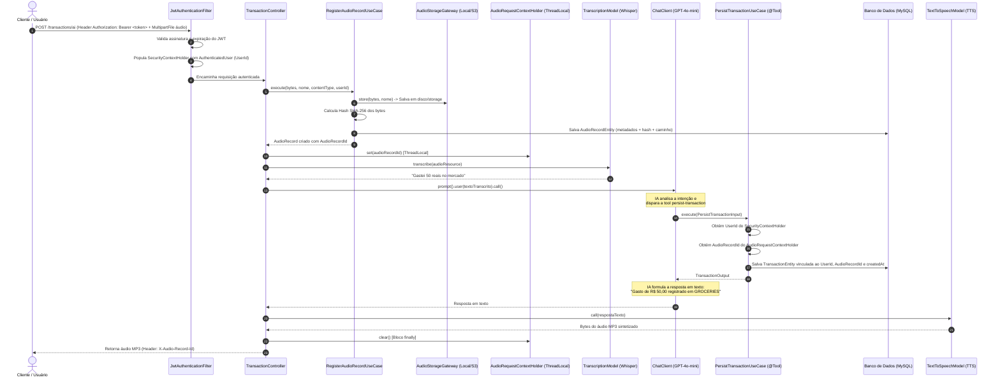
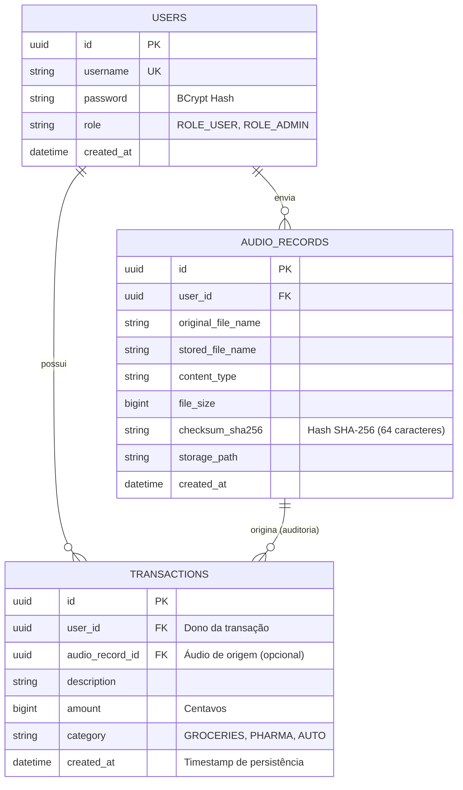

# 💰 DIO Spring Boot & Spring AI - Budgeting AI API (Evolução com JWT & Auditoria)

Este projeto é uma evolução da API inteligente de orçamento financeiro da trilha **DIO Spring Boot & Spring AI**.

A aplicação original introduziu o uso do **Spring AI** para receber comandos de voz, realizar transcrição (*Speech-to-Text* com Whisper), interpretar intenções do usuário (*LLM GPT-4o-mini*), executar funções reais de negócio via ***Tool Calling*** (*Function Calling*), persistir dados financeiros e devolver respostas sintetizadas em áudio (*Text-to-Speech*).

Nesta evolução arquitetural, o projeto foi estendido com padrões profissionais de mercado:
1. 🔐 **Segurança Stateless com Spring Security e JWT**: Autenticação com tokens Bearer e isolamento completo de dados entre múltiplos usuários (*Multi-tenancy*).
2. 🕒 **Auditoria Temporal e de Autoria**: Registro de timestamps (`created_at`) e associação obrigatória ao usuário autenticado (`user_id`).
3. 🎙️ **Rastreabilidade Forense de Áudio**: Gravação física do comando de voz via *Gateway de Armazenamento*, cálculo de integridade com hash criptográfico **SHA-256** e vinculação automática da transação ao registro de áudio de origem (`audio_record_id`).

---

## 🏗️ Arquitetura e Padrões de Projeto

O projeto segue rigorosamente os princípios de **Clean Architecture e Domain-Driven Design (DDD)**:

```
src/main/java/dio/budgeting/
├── domain/                               # Núcleo do Negócio (independente de frameworks)
│   ├── AudioRecord.java                  # Entidade de domínio para metadados de áudio
│   ├── AudioRecordId.java                # Strong Typed ID (UUID)
│   ├── AudioRecordRepository.java        # Interface de persistência de áudio
│   ├── AudioStorageGateway.java          # Interface (Port) para abstrair gravação física
│   ├── Category.java                     # Enum: GROCERIES, PHARMA, AUTO
│   ├── StoredAudio.java                  # Value Object com caminho do storage
│   ├── Transaction.java                  # Entidade de domínio com auditoria e usuário
│   ├── TransactionId.java                # Strong Typed ID (UUID)
│   ├── TransactionRepository.java        # Interface de persistência de transações
│   ├── User.java                         # Entidade de domínio para identidade
│   ├── UserId.java                       # Strong Typed ID (UUID)
│   ├── UserRepository.java               # Interface de persistência de usuários
│   └── UserRole.java                     # Enum: ROLE_USER, ROLE_ADMIN
│
├── application/                          # Casos de Uso (Orquestração e Regras de Aplicação)
│   ├── AuthenticateUserUseCase.java      # Validação de credenciais e emissão de JWT
│   ├── ListTransactionsByCategoryUseCase.java # Consulta com @Tool e filtro por UserId
│   ├── PersistTransactionUseCase.java    # Criação de transação com @Tool, UserId e AudioRecordId
│   ├── RegisterAudioRecordUseCase.java   # Armazenamento físico, hash SHA-256 e auditoria
│   ├── RegisterUserUseCase.java          # Cadastro de usuário com hash BCrypt
│   ├── input/                            # DTOs de Entrada (@ToolParam)
│   └── output/                           # DTOs de Saída Desacoplados
│
└── infrastructure/                       # Adaptadores de Tecnologia (Frameworks e I/O)
    ├── http/                             # Controladores REST e DTOs HTTP
    │   ├── AuthController.java           # Endpoints públicos /auth/register e /auth/login
    │   ├── TransactionController.java    # Endpoints protegidos /transactions e /transactions/ai
    │   ├── request/                      # DTOs de Request
    │   └── response/                     # DTOs de Response
    ├── persistence/                      # Adaptadores JPA e Banco de Dados
    │   ├── entity/                       # UserEntity, TransactionEntity, AudioRecordEntity
    │   └── repository/                   # Spring Data Repositories + Adaptadores JPA
    ├── security/                         # Configurações de Segurança e JWT
    │   ├── AuthenticatedUser.java        # Adaptador UserDetails
    │   ├── JpaUserDetailsService.java    # Carregamento do usuário via UserRepository
    │   ├── SecurityConfig.java           # SecurityFilterChain (STATELESS, BCrypt, Filtros)
    │   └── jwt/
    │       ├── JwtAuthenticationFilter.java # OncePerRequestFilter para validação de Bearer Token
    │       └── JwtService.java              # Geração, validação e extração de claims JWT
    └── storage/                          # Adaptadores de Armazenamento de Arquivos
        ├── AudioChecksumService.java     # Cálculo de hash SHA-256 (MessageDigest)
        ├── AudioRequestContextHolder.java# Context Holder (ThreadLocal) para rastreabilidade
        └── LocalFileSystemAudioStorage.java # Implementação do AudioStorageGateway
```

---

## 🔄 Fluxo de Execução com IA, JWT e Auditoria



---

## 🗄️ Modelo de Dados Relacional



---

## 💡 Design Patterns Aplicados

1. **Adapter Pattern**:
   * `JpaUserRepository` e `JpaTransactionRepository` adaptam as interfaces do Spring Data JPA aos contratos de domínio.
   * `LocalFileSystemAudioStorage` adapta operações de I/O em disco ao contrato `AudioStorageGateway`.
   * `AuthenticatedUser` adapta o `User` de domínio à interface `UserDetails` do Spring Security.
2. **Dependency Inversion Principle (DIP)**:
   * Casos de uso dependem exclusivamente de interfaces (`TransactionRepository`, `AudioStorageGateway`), permitindo trocar o banco de dados ou migrar o storage para AWS S3/MinIO sem alterar regras de negócio.
3. **Chain of Responsibility**:
   * O `SecurityFilterChain` com o `JwtAuthenticationFilter` intercepta e valida requisições HTTP antes de atingirem a camada de apresentação.
4. **Scoped Context / ThreadLocal Context Holder**:
   * `AudioRequestContextHolder` propaga metadados de áudio na thread síncrona da requisição de forma limpa, permitindo que a `@Tool` do Spring AI acesse o `AudioRecordId` sem acoplamento.
5. **Strong Typed Identifiers & Value Objects**:
   * `UserId`, `TransactionId`, `AudioRecordId` e `StoredAudio` encapsulam invariantes e eliminam uso de tipos primitivos dispersos.

---

## 🚀 Guia de Uso da API (Exemplos cURL)

### 1. Cadastro de Usuário
```bash
curl -X POST http://localhost:8080/auth/register \
  -H "Content-Type: application/json" \
  -d '{
    "username": "usuario_dio",
    "password": "senhaSegura123"
  }'
```
**Resposta (HTTP 201 Created):**
```json
{
  "id": "e6a0d4c1-7f92-482a-8d7b-18e3a241b712",
  "username": "usuario_dio",
  "role": "ROLE_USER",
  "message": "User registered successfully"
}
```

### 2. Login e Obtenção do Token JWT
```bash
curl -X POST http://localhost:8080/auth/login \
  -H "Content-Type: application/json" \
  -d '{
    "username": "usuario_dio",
    "password": "senhaSegura123"
  }'
```
**Resposta (HTTP 200 OK):**
```json
{
  "token": "eyJhbGciOiJIUzI1NiJ9.eyJ1c2VySWQiOiJlN2EwZDRjMS03ZjkyLTQ4MmEtOGQ3Yi0xOGUzYTI0MWI3MTIiLCJzdWIiOiJ1c3VhcmlvX2RpbyIsInJvbGUiOiJST0xFX1VTRVIiLCJpYXQiOjE3MD...",
  "type": "Bearer",
  "expiresInMs": 86400000
}
```

### 3. Criar Transação Manualmente (com Token)
```bash
curl -X POST http://localhost:8080/transactions \
  -H "Authorization: Bearer <SEU_TOKEN_JWT>" \
  -H "Content-Type: application/json" \
  -d '{
    "description": "Compras no Supermercado",
    "category": "GROCERIES",
    "amount": 12550
  }'
```

### 4. Consultar Transações por Categoria (Isoladas por Usuário)
```bash
curl -X GET http://localhost:8080/transactions/GROCERIES \
  -H "Authorization: Bearer <SEU_TOKEN_JWT>"
```
**Resposta:**
```json
[
  {
    "id": "c1f72e38-95a2-4bb3-bc5b-9d4f0d611299",
    "category": "GROCERIES",
    "description": "Compras no Supermercado",
    "amount": 125.50,
    "audioRecordId": null,
    "createdAt": "2026-08-23T22:15:30"
  }
]
```

### 5. Enviar Comando de Voz com IA e Auditoria
```bash
curl -X POST http://localhost:8080/transactions/ai \
  -H "Authorization: Bearer <SEU_TOKEN_JWT>" \
  -F "file=@audio_gasto_farmacia.mp3" \
  --output resposta_ia.mp3
```
* O endpoint processa o áudio, salva o arquivo com hash SHA-256, transcreve com Whisper, executa o Tool Calling registrando a transação vinculada ao usuário e ao áudio, e retorna o áudio de resposta sintetizado `resposta_ia.mp3`.
* O cabeçalho HTTP `X-Audio-Record-Id` é retornado na resposta para rastreabilidade imediata.

---

## 🧪 Como Executar os Testes Automatizados

A suíte de testes inclui testes unitários, testes de criptografia BCrypt, testes de geração/validação de JWT, testes de isolamento multi-tenant e testes integrados ponta a ponta:

```bash
./gradlew test
```

### Principais Testes Implementados:
* `UserTest`: Invariantes do modelo de domínio de Usuário.
* `PasswordEncoderTest`: Criptografia unidirecional com salt via BCrypt.
* `JwtServiceTest`: Emissão de JWT, extração de claims, validação de expiração e rejeição de tokens adulterados.
* `AuthControllerIT`: Fluxo completo de registro, login e bloqueio de endpoints sem autenticação.
* `TransactionControllerIT`: Validação de isolamento multi-usuário (Usuário A não tem acesso aos dados do Usuário B).
* `AudioChecksumServiceTest`: Cálculo determinístico de hash SHA-256.
* `LocalFileSystemAudioStorageTest`: Gravação e recuperação de mídia em disco temporário (`@TempDir`).
* `JpaAudioRecordRepositoryTest`: Persistência de registros de auditoria em banco de dados.
* `PersistTransactionUseCaseTest`: Propagação de contexto do `UserId` e `AudioRecordId` para a `@Tool` do Spring AI.
* `TransactionAiFlowIT`: Teste de integração do fluxo completo com simulação de IA.

---

## ⚙️ Como Executar a Aplicação Localmente

### Requisitos:
* **Java 25 ou 26** instalado
* **Docker / Docker Compose** (para o container MySQL 9.6)
* **OpenAI API Key** (para os modelos Whisper, GPT-4o-mini e TTS)

### Passos:
1. Configure a sua chave da OpenAI:
   ```bash
   export OPENAI_API_KEY="sk-proj-sua-chave-aqui"
   ```
2. Inicie a aplicação via Gradle (o Spring Boot Docker Compose inicializará o MySQL automaticamente):
   ```bash
   ./gradlew bootRun
   ```
3. A aplicação estará disponível em `http://localhost:8080`.

---

## 🎓 Principais Aprendizados Consolidados

* **Arquitetura em Camadas (DDD / Clean Architecture)**: Como desacoplar regras de negócio puras de frameworks e bancos de dados.
* **Segurança Profissional com Spring Security & JWT**: Transição de uma API acoplada para uma arquitetura *Stateless* com proteção de rotas, codificação de senhas em BCrypt e claims customizadas.
* **Multi-Tenancy**: Garantia de privacidade e segregação de dados entre diferentes usuários.
* **Auditoria e Compliance**: Aplicação de timestamps de criação e integridade forense de arquivos via hash criptográfico SHA-256.
* **Spring AI & Tool Calling Contextualizado**: Como permitir que modelos de IA executem ações de negócio reais no backend enquanto o framework cuida da segurança e auditoria através de propagação de contexto *thread-safe*.
